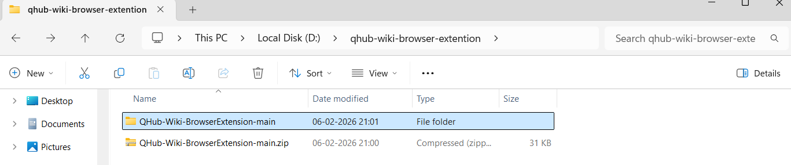
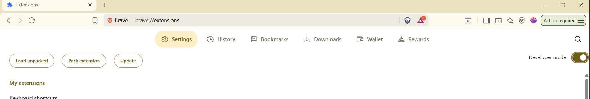
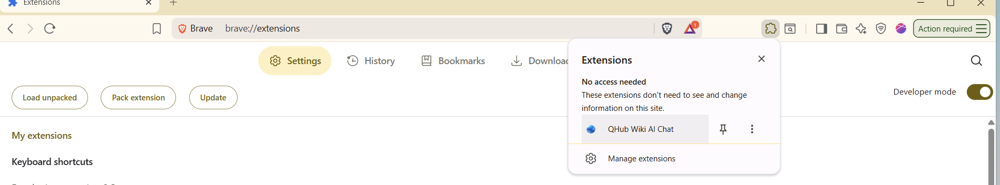
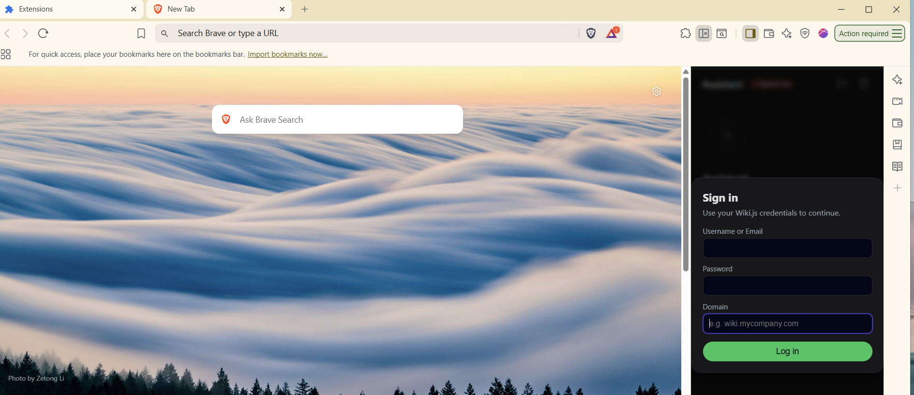

[<- Previous: WikiJS Configuration](WIKIJS.md)
# STEP 1: Download QHub Wiki Browser Extension
[Download QHub Wiki Browser Extension](https://github.com/intelliconnect/QHub-Wiki-BrowserExtension/archive/refs/heads/main.zip)

# STEP 2: Extract to a Folder

# STEP 3: Open Brave/Chrome extension - Enable Developer Mode
Brave: brave://extensions/
Chrome: chrome://extensions/

# STEP 4: Upload

# STEP 5: Open

# STEP 6: Sign-In

[<- Previous: WikiJS Configuration](WIKIJS.md)