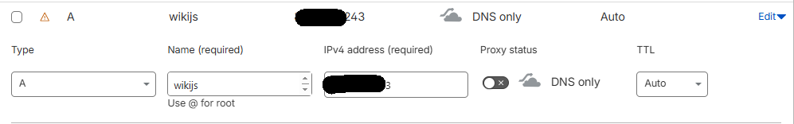
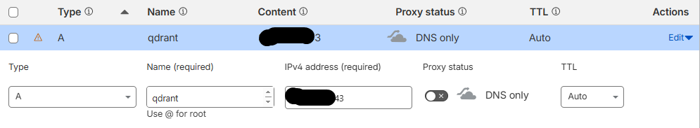
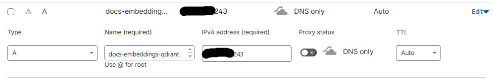

[← Previous: Pre-requisites](SETUP_ANSIBLE_INTRO.md) | [Next: GitHub Config →](GITHUB_CONFIG.md)

## Setup DNS Configuration

Add 3 A records as below:

| Record Type | DNS Name                    | IP Address    |
| ----------- | --------------------------- | ------------- |
| A           | wiki                        | VM Public IP  |
| A           | qdrant                      | VM Public IP  |
| A           | docs-embeddings-qdrant      | VM Public IP  |

**Note**: You can select your own subdomain for wiki (like `wikijs`, `wiki`, `docs` etc).

**Mandatory**: Use `qdrant` as the subdomain  

**Mandatory**: Use `docs-embeddings-qdrant` as the subdomain  

[← Previous: Pre-requisites](SETUP_ANSIBLE.md) | [Next: GitHub Config →](GITHUB_CONFIG.md)