[← Previous: DNS Setup](DNS_SETUP.md) | [Next: Run Ansible Script →](SETUP_ANSIBLE_SCRIPTS.md)

# Create Private GitHub Repository to backup your Knowledge Base
Nuggets: Wiki.js backs up content to a private GitHub repository, where GitHub Actions trigger on changes to automatically rebuild Qdrant embeddings.

Step 1: Login to your github account

Step 2: Create a new private repository

Click on + icon on click on new repository

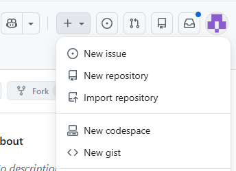

Select an Owner and specify your Repository name
Note: Enable Add README

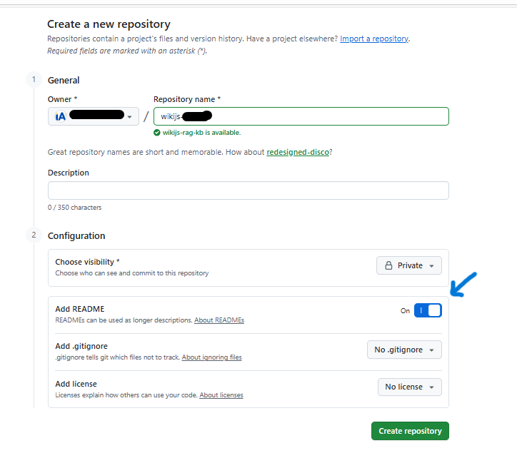

Step 3: Add INGEST_URL and INGEST_API_SECRET in repository secrets
Navigate to Settings -> Secrets and Variables
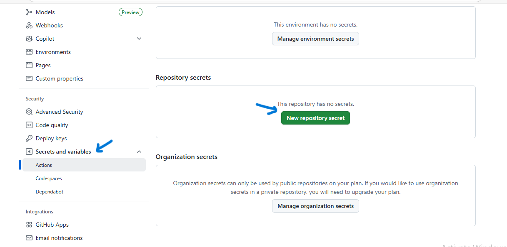

Generate a random secret key using openssl for **INGEST_API_SECRET** This secret will be the same as Uploaded inside Secrets File/ SemaphoreUI 

Run below command on  your Linux server/VM
`openssl rand -base64 64 | tr -d '\n'`

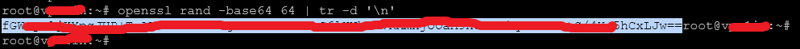

Click on "New repository secret"

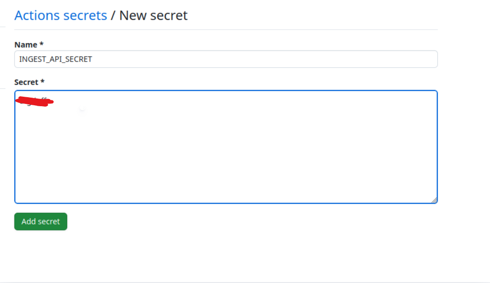

Add **INGEST_URL**
Nuggets: Here the doc-embedding is the address/url of the FAST-API we will deploy via Ansible scripts

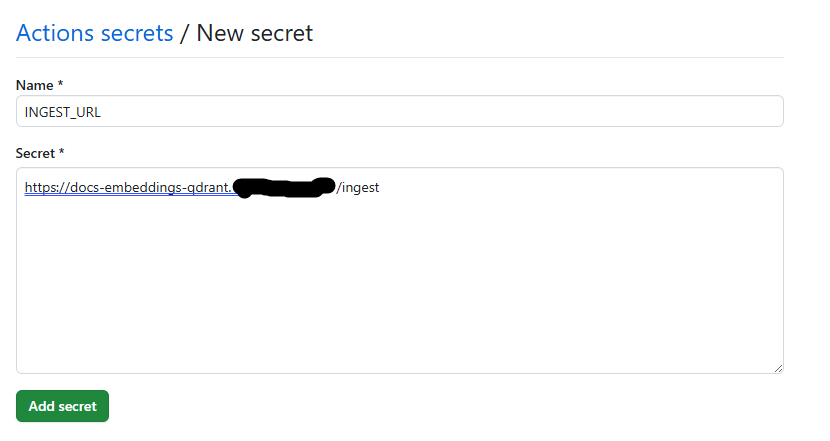

INGEST_URL: https://docs-embeddings-qdrant.[your_domain]/ingest

INGEST_SECRET: [random key generated earlier]
`

### CREATE GITHUB FINE-GRAINED PERSONAL ACCESS TOKEN
Navigate to Profile -> Settings -> Developer Settings 
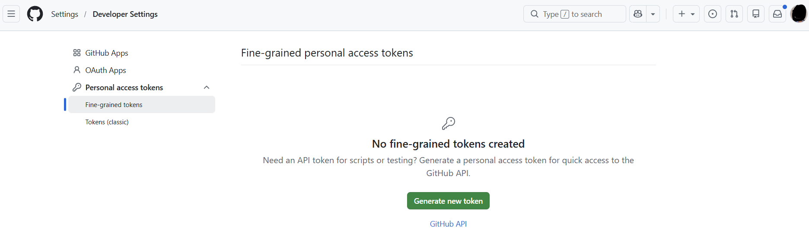

Click on "Generate new token"
Specify a Token name

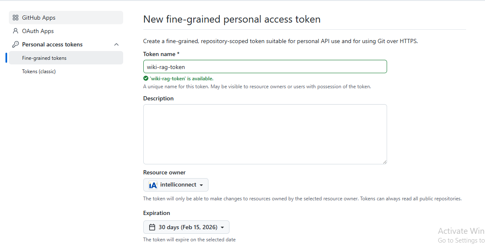

Change Expiry to longest avaialable one

Select Git repository that we created

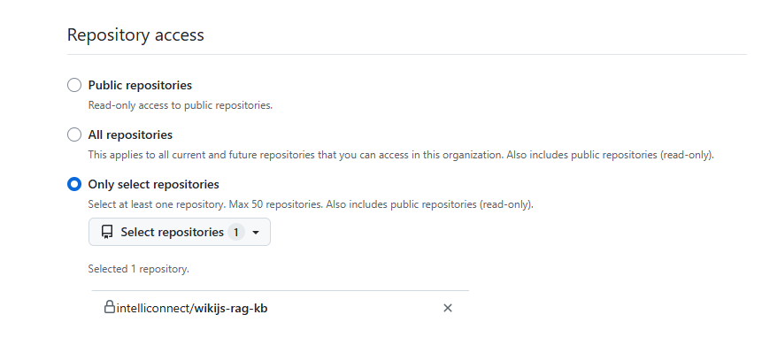

Add Permissions - Administration, Contents and Workflow (Metadata is added by default)

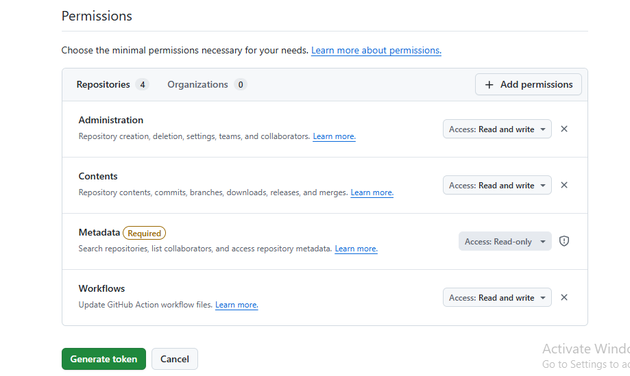

Generate and Copy. This token is KB_REPO_GITHUB_TOKEN as defined in Pre-requisites

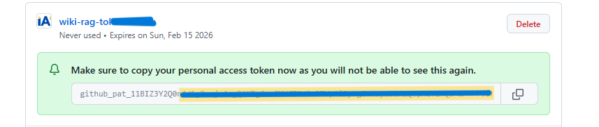

[← Previous: DNS Setup](DNS_SETUP.md) | [Next: Run Ansible Script →](SETUP_ANSIBLE_SCRIPTS.md)
