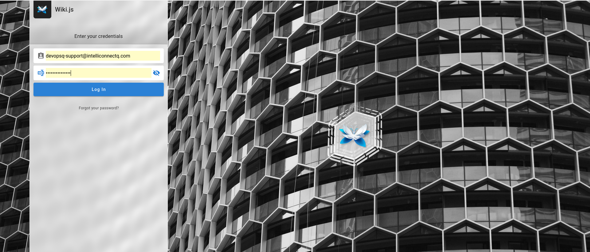
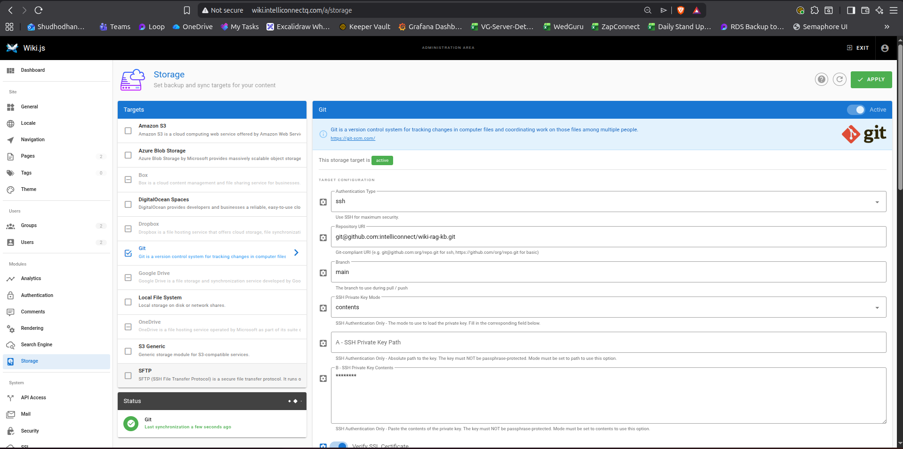

[← Previous: Run Ansible Script](SETUP_ANSIBLE_SCRIPTS.md) | [Next: Load Custom Browser Extension →](BROWSER-EXT.md)

Login using the previously shortlisted login/pwd

You will be prompted to create a home page

Choose Administration and Navigate to GitHub storage link

Navigate to System -> Storage

You will see the github sync auto-added by the ansible script

[← Previous: Run Ansible Script](SETUP_ANSIBLE_SCRIPTS.md) | [Next: Load Custom Browser Extension →](BROWSER-EXT.md)
